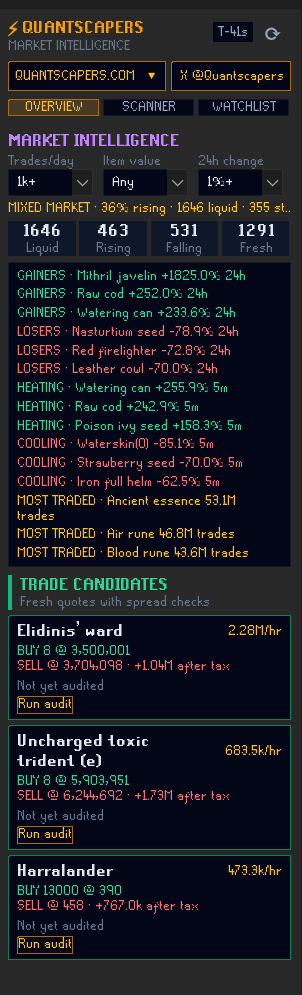
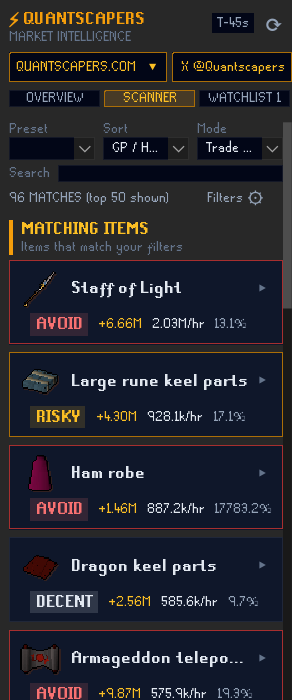
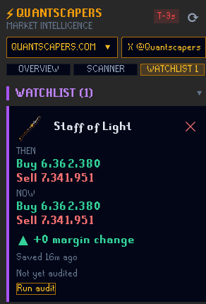

# QuantScapers

An in-client **OSRS Market Intelligence tool** for RuneLite.

QuantScapers helps you understand the Grand Exchange before you act: read
liquid market movers, research individual items, evaluate trade and alchemy
opportunities, and keep a local Watchlist of prices that matter to you.

| Market Overview | Scanner | Watchlist |
| --- | --- | --- |
|  |  |  |

## What you can do

- **Start with market context.** The default Overview is a local Market
  Intelligence view: it summarizes whether liquid markets are broadly
  rising, falling, or mixed, then surfaces liquid movers, heating/cooling
  momentum, and the most-traded items. Click any signal to hand it to Scanner
  for execution details. Set minimum trade volume, item value, and movement
-  thresholds directly above the panel to remove low-signal noise. It adds
  context alongside dedicated execution tools.
- **Find opportunities.** Use the Scanner to evaluate trade candidates
  using profit, ROI, budget, fill-time, volume, and freshness filters. Each item
  receives a clear BUY, DECENT, RISKY, or AVOID verdict with an explanation.
- **Evaluate alchemy.** Switch to Alch View to rank high-alchemy opportunities by
  profit, ROI, or GP per hour using the same scheduled price snapshot.
- **Research items.** Search the current market by item name, expand an item
  for its price details and trade ticket, or run a price history audit.
- **Keep a Watchlist.** Track up to 25 items locally, compare prices and
  margin now against when you saved them, and audit a saved item directly.
- **Open the website.** The in-plugin `QUANTSCAPERS.COM` menu links to
  the market overview, item table, and gear indices. Follow
  [@Quantscapers on X](https://x.com/Quantscapers) for updates.

## How it works

QuantScapers is decision support, not automation.

- **Order tickets** provide buy price, sell price, quantity, after-tax profit,
  and a walk-away timer for you to enter manually.
- **Trust guards** flag stale quotes, possible price manipulation, and cooling
  momentum before a candidate is presented for execution.
- **Price history audits** use an item's hourly history to calculate sell-price
  hit rate and a seven-day margin-stability grade.
- **Notifications** are optional and can be limited to trade candidates, Alch
  candidates, or both.

## Data source and privacy

QuantScapers uses the [OSRS Wiki Real-time Prices API](https://prices.runescape.wiki/osrs/).

- Wiki market data is off by default. No request is made until you explicitly
  enable it in the plugin settings.
- While the panel is visible, the latest-price snapshot refreshes at most once
  per 60 seconds. All polling stops when the panel is closed.
- It uses only the existing Wiki API endpoints; switching tabs, searching,
  opening the Watchlist, and using the market overview do not create extra
  price requests.
- Five-minute and 24-hour statistics are cached for five minutes, and the item
  mapping is cached for 24 hours. Transient API failures trigger capped
  exponential backoff.
- Price history audits run on demand or for top trade candidates, with the
  automatic audit budget capped at three calls per 30 minutes.
- Every request includes a fixed descriptive User-Agent linking to the public
  GitHub issue tracker; no personal email is requested. The Wiki API receives
  your IP address as normal HTTP metadata.

QuantScapers sends no RuneScape account data, credentials, GE offers,
telemetry, or cloud sync data, and has no first-party data collection.

## No Grand Exchange automation

QuantScapers never reads, writes, places, edits, or cancels Grand Exchange
offers. It does not perform actions for you. Any ticket values are guidance
for you to enter yourself; copy actions use your clipboard only.

## License

BSD 2-Clause. Copyright © 2026 Tim to Slay. See [LICENSE](LICENSE).
