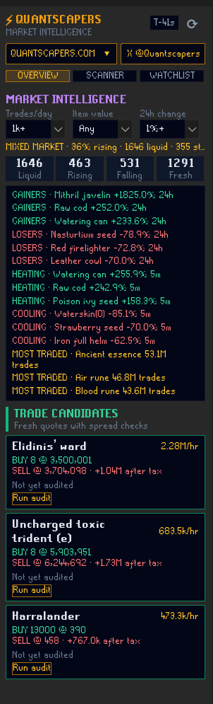

# QuantScapers

A verdict-first Grand Exchange flipping terminal, in-client.

Every tradeable item gets a deterministic **BUY / DECENT / RISKY / AVOID**
call with a plain-English reason, plus an exact order ticket (quantity,
buy price, sell price, after-tax profit, walk-away timer) so you know
precisely what to place and when to walk away.

## Features

- **Verdicts, not just numbers.** Every card explains *why* — stale quotes,
  possible price manipulation, cooling momentum, or a clean, fast, profitable
  flip.
- **Order tickets.** Buy quantity, buy+1, sell−1, after-tax profit, and a
  walk-away timer, ready to copy into the Grand Exchange.
- **Top Picks.** The three best flips ranked by GP/hour, auto-audited against
  a deep-probe of hourly price history.
- **Trust guards.** Stale-quote detection (>30 min old), trap detection
  (spread far outside an item's own 24h norm on thin volume), and a momentum
  signal (5-minute average vs 24-hour average).
- **Deep-Probe Audit.** On demand, pulls an item's hourly price history to
  compute a sell-price hit rate and a 7-day margin stability grade (A–F).

## Data source & polling

QuantScapers uses the [RuneScape Wiki real-time prices
API](https://prices.runescape.wiki/osrs/) — the same public API used by
other flipping plugins. It polls every 30 seconds while the panel is open,
and pauses when the panel is closed. Timeseries (deep-probe audit) calls are
made only when you click Audit, or automatically for Top Picks, capped at 3
calls per 30 minutes.

**Set a contact email in plugin settings.** Every request carries a
User-Agent identifying this plugin plus your email, so the wiki maintainers
can reach you specifically if your traffic ever causes an issue. Each
install should use its own real email — don't leave it blank or copy
someone else's, since that defeats the point of per-user identification.

QuantScapers won't make a single request to the wiki until that email is
set — the panel shows an explanation instead of data until you do.

## No automation

This plugin never reads, writes, or interacts with Grand Exchange offers. It
does not place, edit, or cancel offers on your behalf. Ticket numbers are
provided for you to enter manually; a copy button puts a number on your
clipboard, nothing more.

## License

BSD 2-Clause. See [LICENSE](LICENSE).
